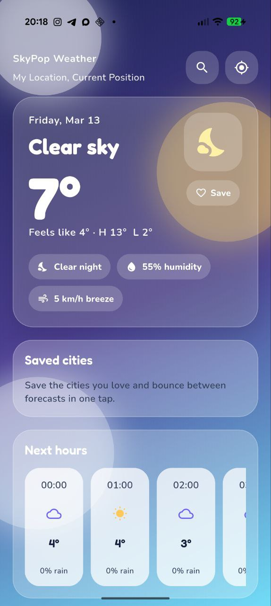

# SkyPop Weather

SkyPop Weather is a playful Flutter weather app with a colorful UI, city search, saved locations, and English/Russian localization.

This is a pet project built to test the abilities of coding agents on a small but real app workflow: UI work, product polish, localization, docs, and Git operations.

## Screenshot



## Features

- current weather, hourly forecast, and 7-day forecast
- geolocation-based startup and manual city search
- saved favorite cities
- English and Russian language support with in-app switching
- Flutter + Riverpod architecture

## Run locally

```bash
flutter pub get
flutter run
```

## Test

```bash
flutter analyze
flutter test
```

## CI/CD

This project uses GitHub Actions for continuous integration and deployment:

- **CI Workflow**: Runs on every push and pull request to `main`/`master`
  - Code analysis with `flutter analyze`
  - Unit tests with `flutter test`
  - Debug APK build to verify Android compilation

- **Release Workflow**: Triggered when a GitHub release is published
  - Builds a release APK
  - Automatically attaches the APK to the GitHub release

To create a new release:
1. Go to repository → Releases → Draft a new release
2. Create a tag (e.g., `v1.0.1`)
3. Publish the release
4. The APK will be built and attached automatically
